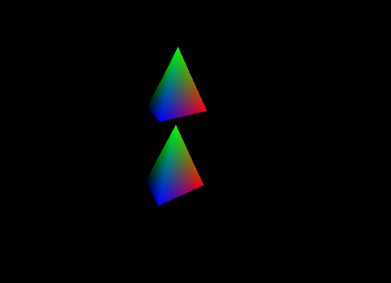

# RenderingEngineGL
My first rendering engine! RenderingEngineGL is a real time 3D rendering engine made with OpenGL. It's based on the learnopengl, Computer Graphics with Modern OpenGL and C++, and the Ray Tracing in One Weekend courses. 

## Why? 
I was always mesmerized by computer graphics and had a deep desire to learn about them. It's the first thing I noticed when I was a kid playing Kingdom Hearts II (Playstation 2) and Star Fox Adventure (GameCube). This is the start of my journey to satisfy that desire :)!!!

## Download

## Render Samples

Figure 1: First 3D Shape Render

## Supported Features
- [x] 3D Camera
- [ ] Image Loading
- [ ] Framerate Component
- [ ] Texture Mapping
- [ ] Ambient Lighting (Phone Reflection 1/3)
- [ ] Diffuse Lighting (Phong Reflection 2/3)
- [ ] Specular lighting (Phong Reflection 3/3)
- [ ] Point and Spot lights
- [ ] Importing 3D Models
- [ ] Directional Shadow Mapping
- [ ] Omnidirectional Shadow Mapping
- [ ] Cubemaps
- [ ] Skybox
- [ ] Brut Force Path Tracer (Ray Tracing in One Weekend)
- [ ] More Sophistocated Path Tracer (Ray Tracing: The Next Week)
- [ ] Very Serious Path Tracer (Ray Tracing: The Rest of Your Life)

## Dependencies
- OpenGL 3.3+
- GFLW3
- GLM
- assimp
- Visual Studio 2022

## Build Instructions 
### Windows 
- step 1
- step 2
### Linux
- Not supported :(. Future Plans is to make a cross platform Vulkan Engine with cmake (January 2024 - February/March 2024 timeline)

## References
