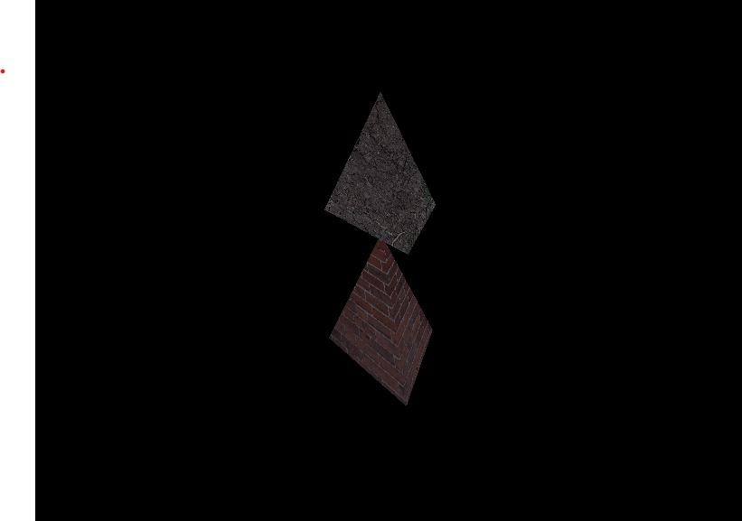

# RenderingEngineGL
My first rendering engine! RenderingEngineGL is a real time 3D rendering engine made with OpenGL. It's based on the learnopengl, Computer Graphics with Modern OpenGL and C++ udemy courses. 

## Why? 
I was always mesmerized by computer graphics and had a deep desire to learn about them. It's the first thing I noticed when I was a kid playing Kingdom Hearts II (Playstation 2) and Star Fox Adventure (GameCube). This is the start of my journey to satisfy that desire :)!!!

## Demos (only has ambient lighting but diffuse lighting works)
https://www.youtube.com/playlist?list=PLahcOfCTPH8oRD668zuTAFDBFtcYa6t5B

## Render Samples

Figure 1: First 3D Shape Render

Figure 2: Texture on 3D Shape

Figure 3: Ambient Lighting

Figure 4: Diffuse Lighting

## Supported Features
- [x] 3D Camera
- [x] Image Loading
- [x] Texture Mapping
- [x] Ambient Lighting (Phone Reflection 1/3)

## Dependencies
- OpenGL 3.3+
- GFLW3
- GLM
- assimp
- Visual Studio 2022

## References
- [Udemy OpenGL in C++ Course] https://www.udemy.com/course/graphics-with-modern-opengl/?kw=OpenGL&src=sac
- [learn OpenGL Website] https://learnopengl.com/

## Updates 01/29/2024
### I won't be making any updates from here. There is still a lot I could have done like finishing the phong reflection model (specular lighting), point light, spot light, and shadows) but I wanted to start on more modern things. This was an education exercidse before I got into ray tracing and more modern graphics stuff. Thanks!
